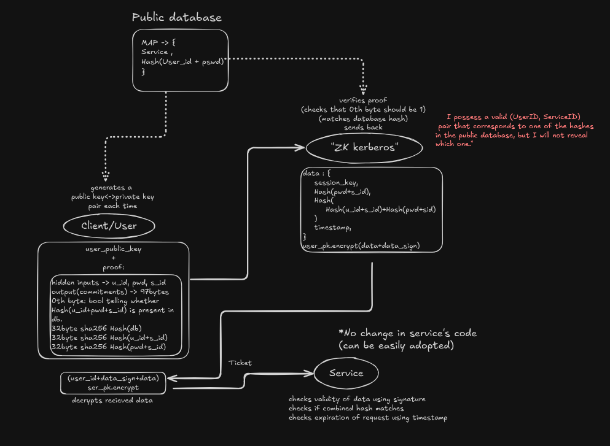
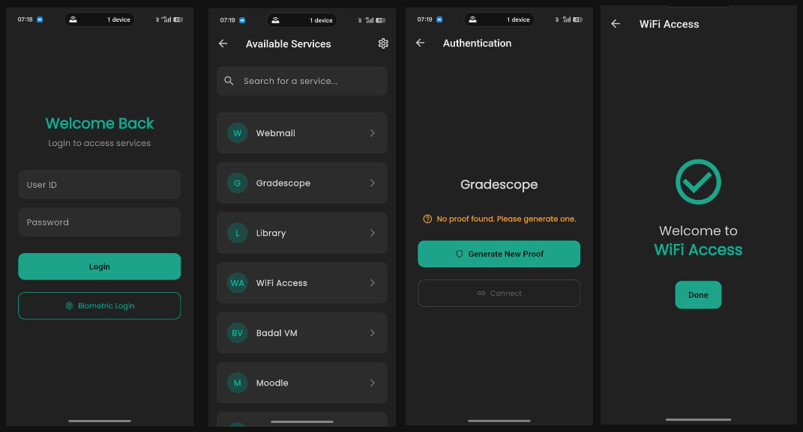

# ZK kerberos

<div align="center">
  
  
  
  </br>
</div> 

Zero-knowledge Kerberos: users can authenticate with complete anonymity. The Kerberos validates their rights without ever learning their identity or the specific service they are targeting.

## Architecture

```
├── LICENSE
├── README.md
├── zkk_app
│   ├── mopro-r0-example-app # 📱 MOBILE APP
│   │   ├── build
│   │   ├── Cargo.toml
│   │   ├── Config.toml
│   │   ├── flutter
│   │   ├── Makefile
│   │   ├── MoproAndroidBindings
│   │   ├── README.md
│   │   └── src
│   ├── README.md
│   ├── risc0-circuit # ⚡ RISC0 PROVER CIRCUIT
│   │   ├── Cargo.toml
│   │   ├── LICENSE
│   │   ├── methods
│   │   ├── README.md
│   │   └── src
└── zkk_server # 🖥️ Actual zk-kerberos server
    ├── Cargo.lock
    ├── Cargo.toml
    ├── Dockerfile
    ├── README.md
    ├── src
    │   ├── keys.rs
    │   └── main.rs
    └── target
```

## 🔄 Core protocol



## 🗄️ Database

Using a public, verifiable database of hashes creates a more transparent and decentralized system where permissions can be audited without compromising user privacy. Hosted on Filecoin (locally for testing)

## ⚙️ Working

### Starting zk-kerberos server

```bash
cd zkk_server/
cargo run
```

zkk server will run on port "7878"

### Compiling RISC0

```bash
cd zkk_app/risc0-circuit/
cargo run
```

!TODO->add image of ticket generated

### Running Mopro

- connect mobile, enable USB debugging (basically do the initial flutter setup)
-
```bash
cd zkk_app/mopro-r0-example-app/  # you might need to do cd ..
make
```

#### Mobile Demo



### Web client

```bash
cd zkk_webclient
sh build.sh
# follow the further instructions
```
