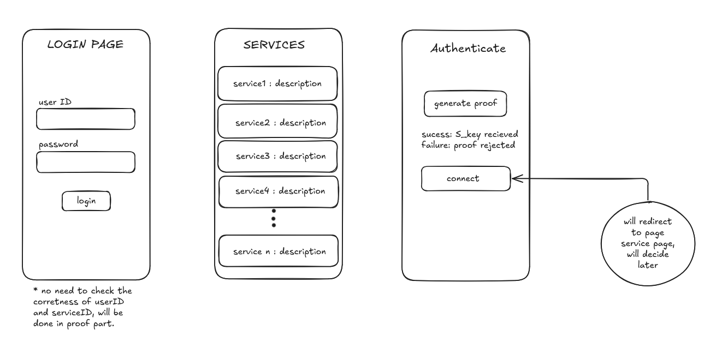

# zk_kerberos

Zero-knowledge Kerberos: users can authenticate with complete anonymity. The Kerberos validates their rights without ever learning their identity or the specific service they are targeting.

## Architecture

```
├── LICENSE
├── README.md
├── zkk_app
│   ├── mopro-r0-example-app # MOBILE APP
│   │   ├── build
│   │   ├── Cargo.toml
│   │   ├── Config.toml
│   │   ├── flutter
│   │   ├── Makefile
│   │   ├── MoproAndroidBindings
│   │   ├── README.md
│   │   └── src
│   ├── README.md
│   ├── risc0-circuit # RISC0 PROVER CIRCUIT
│   │   ├── Cargo.toml
│   │   ├── LICENSE
│   │   ├── methods
│   │   ├── README.md
│   │   └── src
└── zkk_server # Actual zk-kerberos server
    ├── Cargo.lock
    ├── Cargo.toml
    ├── Dockerfile
    ├── README.md
    ├── src
    │   ├── keys.rs
    │   └── main.rs
    └── target
```

## Database
Using a public, verifiable database of hashes creates a more transparent and decentralized system where permissions can be audited without compromising user privacy. Hosted on Filecoin.

## Mobile app



